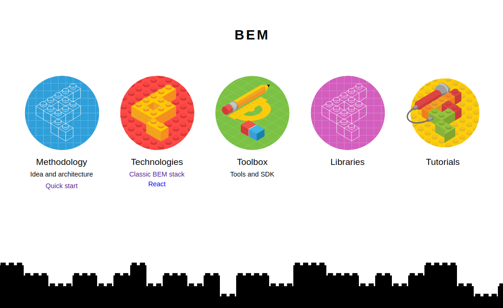

Con esta entrada voy a dar por terminada una serie de textos en los que he desarrollado algunos ejemplos sencillos sobre Hojas de Estilo en Cascada o CSS  para el desarrollo de aplicaciones web mapas.


Para finalizar, voy a explicar como añadir un panel lateral a modo de navegador y dejar apuntado la aplicación BEM como metodología de guía de estilos.

# Aplicando una guía de estilos a nuestro CSS

Con el objetivo de crear código más legible, mantenible y escalable y al igual que se hace cuando escribimos código JavaScript, existen un conjunto de guías de estilo CSS que podemos usar.

Este tema es totalmente nuevo para mi la verdad, pero tras la lectura del completísimo artículo ["CSS Craftsmanship"](https://softwarecrafters.io/css/css-craftsmanship) del **Joan León** [@nucliweb](https://twitter.com/nucliweb) en el blog de Software Crafters, me he decidido al menos dejarlo apuntado.

Esta metodología, desarrollada por el equipo de Yandex, se basa en nombrar las clases distinguiendo entre bloques, elementos y modificadores, de ahí su nombre, **Block Element Modifier o BEM**. El método, según se pueden ver en su [web](https://en.bem.info/), es también apliable al desarrollo de componentes JavaScript.



Un **Bloque** es el nivel superior de abstracción de un nuevo componente independiente. Un bloque pueden componerse de otros bloques. En nuestro caso, nuestra barra de botones sería un bloque identificado con la clase *.header-nav*. 

Los bloques están compuestos por **Elementos**, que se situán dentro de los bloques y que cumplen una función específica. El nombre de las clases de los elementos se define a partir del bloque padre, seguido de doble barra baja y su nombre. Los botones de nuestra barra de navegación tiene la clase *header-nav__btn*. 

Para terminar, los **Modificadores** representan entidades que usaremos para definir la apariencia o comportamiento de un Bloque o Elemento concreto. Los Modificadores los representaremos con doble guión. Los he usado para diferenciar el datos de la ciudad y del númro de habitantes. 

El código html del la barra de botonones quedaría de esta manera al aplicar la metdología BEM en las clases CSS.

```html
    <header>
        <nav class="header-nav">
            <a class="header-nav__btn header-nav__logo" href="#">CSS MAP</a>
            <a class="header-nav__btn" id="init-view" href="#">Init View</a>
            <a class="header-nav__btn" id="view-zoom" href="#">Zoom level</a>
            <a class="header-nav__btn" id="view-extent" href="#">View Extent</a>
        </nav>
    </header>
```

Según la documentación, usando esta metodología deberíamos omitir los IDs con el fin de fomentar la reutilización del código. En la web los he mantenido porque los usamos para asignarle lógica JavaScript.

En el CSS, todo esto se traduce en las siguientes líenas.

```css
/* header-nav block */
...
.header-nav {
    overflow: hidden;
    background-color: var(--bg-header);
    -webkit-box-shadow: 0px 2px 5px 0px rgba(100, 100, 100, 1);
    -moz-box-shadow: 0px 2px 5px 0px rgba(100, 100, 100, 1);
    box-shadow: 0px 2px 5px 0px rgba(100, 100, 100, 1);
    display: flex;
    flex-direction: row;
    flex-wrap: wrap;
    justify-content: flex-start;
    
}

.header-nav__btn {
    color: var(--font-color-nav);
    text-align: center;
    padding: 14px 16px;
    text-decoration: none;
    font-size: 17px;
    display: block;
}
...

```
## Panel lateral

Muchísimas aplicaciones web de mapas cuentan con uno a varios paneles laterales. Estos son usado para añadir el control de capas, embeber formularios, usarlos cara mostrar detalles de consultas... Nuestra aplicación va a contar con una panel laterla con un listado de ciudades de Europa y su población.

Los datos cargaremos desde un archivo JSON, generado a partir de la información de la web [Natural Earth](http://www.naturalearthdata.com/). En un principio pensaba cargarlos como formato GeoJSON usando Openlayers, pero ya que tenía ganas de jugar con Javascript, los he pasado a JSON y están programado como si se consumira mediente una API usando el método Fetch y promesas.

```javascript
// getData.js

const url = './data/cities.json'

export default function getData() {
    return fetch(url)
        .then(res => res.json())
        .then(response => {
            const data = response
            return data
        });
}
```

He ajustado el ancho del panel lateral como el del mapa, indicando una altura a partir de dispositivo menos la barra superior. Ya que la lista de ciudades de España es amplia, la caja tiene una barra de desplazamiento mediante la propiedad overflow.

Para la versión responsive, el panel se coloca encima del mapa usando Flexbox, permitiendo con ello ver el listado y el mapa de forma simultánea.

Como mejora, al hacer click en cada ciudad, la aplicación ajusta el zum de la vista.

# Fin

Solo quiero comentar, que además de la utilidad que hayan podido tener para aquellos que los lean, personalmente ha sido una magnífica oportunidad para aprender nuevos conceptos y habilidades dentro del campo del desarrollo web.

Sin duda habrá muchas mejoras, el repositorio está abierto a ello y seguro que son bien recibidas.

