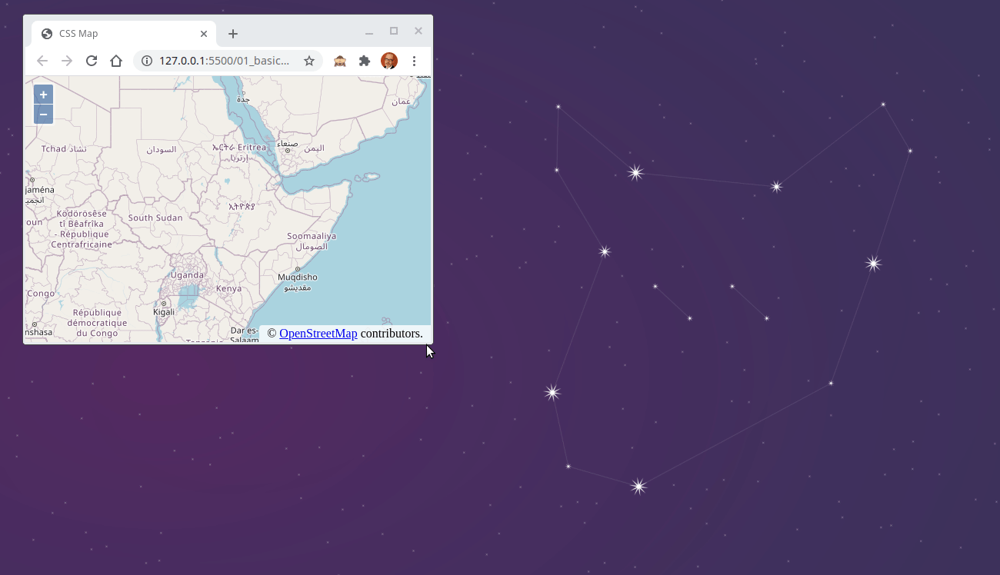

# CSS para mapas

Ejemplos de CSS para diseños de aplicaciones web de mapas.

## 01 Visor a pantalla completa

- [Web Ejemplo 1](http://www.sigdeletras.com/css-map/01_full_viewport/index.html)
- Entrada [CSS para mapas. Visor a pantalla completa](http://www.sigdeletras.com/2020/css-para-mapas-visor-a-pantalla-completa/)
- Carpeta de código [01_full_viewport](01_full_viewport)

## 02 Menú de opciones

- [Web Ejemplo 2](http://www.sigdeletras.com/css-map/02_header_menu/index.html)
- Entrada [CSS para mapas. Menú de opciones](http://www.sigdeletras.com/2020/css-para-mapas-menu-de-opciones/)
- Carpeta de código [02_header_menu](02_header_menu)

## 03 Flexbox y diseño responsive

- [Web Ejemplo 3](http://www.sigdeletras.com/css-map/03_flexbox_responsive/index.html)
- Entrada - [CSS para mapas. Flexbox y diseño responsive](http://www.sigdeletras.com/2020/css-para-mapas-flexbox-y-diseño-responsive/)
- Carpeta de código [03_flexbox_responsive](03_flexbox_responsive)

## 04 Sidepanel y guía de estilos CSS DEM

- [Web Ejemplo 4](http://www.sigdeletras.com/css-map/04_sidepanel/index.html)
- Entrada - [CSS para mapas. Panel lateral y guía de estilos BEM](http://www.sigdeletras.com/2020/css-para-mapas-panel-laterial-y-guia-de-estilos-bem//)
- Carpeta de código [04_sidepanel](04_sidepanel)

